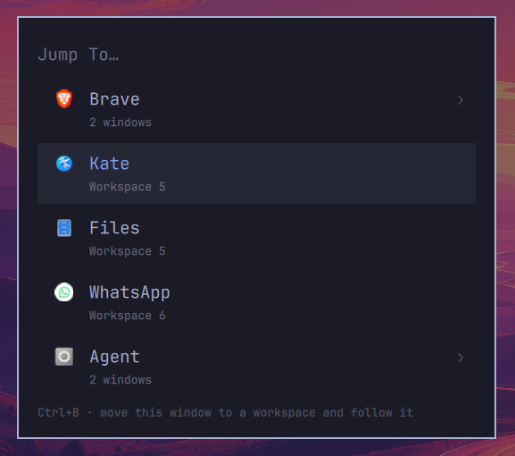

# Jump To

A searchable window switcher for the [Omarchy](https://omarchy.org/) shell.



Omarchy's launcher lists applications you can start. This lists the ones already
open, and takes you to them.

## What it does

The switcher opens on the apps that currently have a window, most recently used
first, with the window you are sitting in pushed to the bottom. The row under the
cursor is therefore the window you were in a moment ago, so Enter on an untouched
switcher means "take me back".

An app with one window jumps straight to it. An app with several gets a chevron
into its own window list, where each row carries the window title and its
workspace. Typing collapses both levels into one ranked list, matched against
window title, app name, window class and workspace name.

Ctrl+B on a window row sends that window to a workspace and follows it there. A
hint line under the list names whichever keys are live at that moment, so the
shortcut does not have to be remembered.

The overlay draws from the shell's `[menu]` theme surface, so it picks up the
active Omarchy theme's palette, font, corner radius and border style. It carries
no colors of its own.

## Keys

| Key | Action |
|-----|--------|
| any character | filter across every open window |
| `↑` `↓` | move the cursor, wrapping at both ends |
| `PgUp` `PgDn` | move a page |
| `Enter` or `→` | jump to the window, or open an app's window list |
| `←` or `Backspace` | leave an app's window list |
| `Esc` | clear the filter, then close |
| `Ctrl+U` | clear the filter outright |
| `Ctrl+B` | send this window to a workspace and follow it. The next digit picks the workspace |
| `Ctrl+Shift+B` | the same, but collect digits until `Enter` |
| click | jump to a row |

Ctrl+B arms only on a window row. An app row with a chevron covers several
windows, so there is nothing single to move.

The workspace is read literally: `Ctrl+B` `3` sends the window to workspace 3.
Ctrl+Shift+B also works while the one-digit prompt is already up, so a prompt
started with Ctrl+B can be upgraded to a longer number without backing out.
Committing moves the window, focuses it, and closes the switcher.

## Install

```bash
omarchy plugin add https://github.com/StavWasPlayZ/omarchy-jump-to --enable
```

Omarchy plugins run as unsandboxed code inside the long-lived `omarchy-shell`
process. Read `JumpTo.qml` and `Model.js` before enabling this or any other
plugin.

Nothing outside the plugin's own directory is written or modified. The menu row
and the keybind below are yours to add, and yours to remove.

Beyond Omarchy itself the plugin shells out to `hyprctl` and `bash`, both of
which a working Omarchy install already has.

### Remove it

```bash
omarchy plugin remove dev.cstav.omarchy.plugin.jump-to
```

That deletes the plugin directory and drops its entry from `shell.json`. If you
added the menu row or the keybind, delete those two blocks by hand: the plugin
never wrote them, so it cannot take them back.

### Add it to the Omarchy menu

Put a row in `~/.config/omarchy/extensions/omarchy-menu.jsonc`:

```jsonc
"jump-to": {
  "icon": "󰖯",
  "label": "Jump To...",
  "description": "Switch to an open window",
  "aliases": ["windows", "switcher", "alt-tab"],
  "action": "omarchy-shell -q shell summon dev.cstav.omarchy.plugin.jump-to"
},
```

The menu watches that file, so the row appears without a restart. It is an
action row rather than a submenu, which is why it shows no chevron of its own:
the Omarchy menu draws one only on rows that navigate inside the menu.

### Bind a key

A keybind beats a trip through the menu. In `~/.config/hypr/bindings.lua`:

```lua
o.bind("SUPER + SLASH", "Window: Jump to",
  "omarchy-shell -q shell toggle dev.cstav.omarchy.plugin.jump-to")
```

## How rows are named

A window class is a launcher detail, so rows are named the way a person would
name the app:

- A class the desktop database recognises gets that application's name and icon.
- An Omarchy web app is installed without a `StartupWMClass`, so the desktop
  database cannot find it by class at all. The site in its window class is
  matched against the URL in each launcher's `Exec` instead, so WhatsApp is
  named `WhatsApp` and carries its own icon rather than `web.whatsapp.com` and a
  placeholder.
- A web app whose launcher hides the URL behind a handler script has nothing to
  match on. It keeps its site as the label, `app.hey.com` for instance, and
  borrows the icon of the browser hosting it.
- A reverse-DNS class such as `org.omarchy.agent` is named by its last segment.

## Requirements

Omarchy 4.x with the Quickshell-based shell (`omarchy-shell`), running on
Hyprland.

Window data comes from `hyprctl clients -j` rather than Quickshell's
`Hyprland.toplevels`, because `focusHistoryID` exists only in the IPC payload
and the most-recently-used ordering is built from it.

Focusing and moving go through `hyprctl dispatch` using Hyprland's Lua
dispatcher syntax, falling back to the older `focuswindow` and
`movetoworkspacesilent` forms when the Lua call is rejected.

## Layer rules

The overlay's layer-shell namespace is `omarchy-jump-to`, so Hyprland layer
rules can target it. Omarchy's own overlays turn animations off, and this line
in `~/.config/hypr/` gives the switcher the same treatment:

```lua
hl.layer_rule({ match = { namespace = "omarchy-jump-to" }, no_anim = true, animation = "none" })
```

## Working on the plugin

The manifest sets `keepLoaded: true`, which keeps the overlay mounted between
summons. The shell's file watcher logs a reload when a plugin file changes, but
the mounted overlay goes on running the old QML. Run `omarchy restart shell` to
pick up an edit.

## Files

| File | Contents |
|------|----------|
| `manifest.json` | plugin manifest: an `overlay` kind with `JumpTo.qml` as its entry point |
| `JumpTo.qml` | the overlay window, key handling and row rendering |
| `Model.js` | parsing `hyprctl clients`, grouping, naming and search ranking |

## License

MIT. See [LICENSE](LICENSE).
